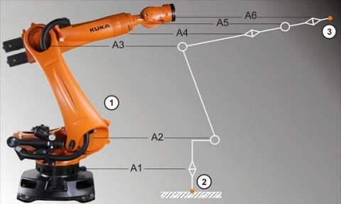
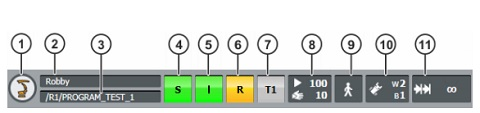
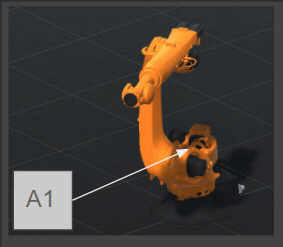
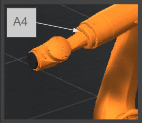
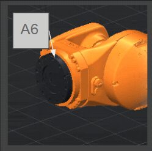
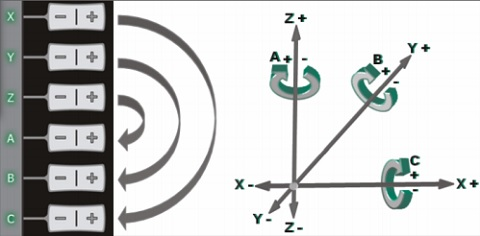
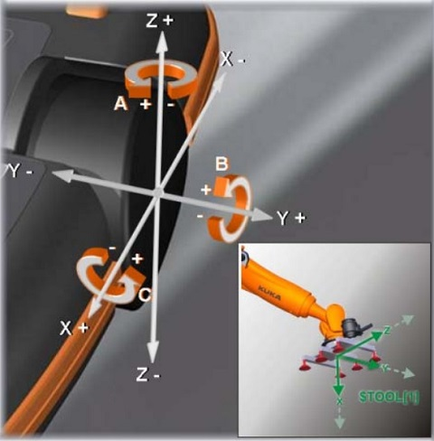

# 機器手臂基本介紹

- 機器手臂系統

①機器人本體

②控制器

③教導器（SmartPAD）

④連接線（動力線、訊號線等）

- 機器手臂結構

①底座

②轉盤

③平衡系統

④連結臂

④手臂

⑤腕關節

- 機器手臂骨架

①機器人實體

②運動鏈起點（ROBROOT）

③運動鏈自由端（法蘭）

 

### 機器手臂教導器（SmartPAD）

- SmartPAD-2 正面

①USB：可將程式透過隨身碟上傳到控制器

②斷線按鈕：拔除教導器的按鈕

③模式旋鈕：切換模式（T1、T2、AUT、EXT）

④緊急停止按鈕

⑤6D滑鼠

⑥軸∕座標吋動按鈕：控制單軸移動

⑦手帶

⑧程式速度控制按鈕：手動程式∕自動模式的運轉速度+∕-

⑨手動速度控制按鈕：吋動模式的運轉速度+∕-

⑩連接線：連接至KR C4的訊號線

⑪自訂按鈕：供擴充套件使用

⑫開始鍵：開始執行程式

⑬倒退鍵：T1模式中移動回上一個位置

⑭暫停鍵：暫停執行中的程式

⑮鍵盤鍵：開啟∕關閉虛擬鍵盤

⑯主選單鍵：開啟∕關閉主選單

- SmartPAD-2 背面

①背帶固定扣（選配）

②支撐帶

③左側拱頂（右手握）

④啟用開關（Engage）：在T1∕T2模式下必須輕壓才能吋動手臂或執行程式，若是未壓下或是重壓則機器手臂會停止動作

⑤開始鍵：開始執行程式

⑥啟用開關

⑦手帶

⑧連接線蓋板

⑨啟用開關

⑩右側拱頂（左手握）

- 主畫面

①狀態列

②訊息圖示

③訊息欄

④6D滑鼠座標空間參考

⑤6D滑鼠相對位置切換

⑥吋動座標空間參考

⑦吋動方向參考

⑧速度調整參考圖示（程式用）

⑨速度調整參考圖示（吋動用）

⑩功能按鈕區

⑪專案資訊按鈕

⑫時間資訊按鈕

⑬權限切換按鈕

⑭SmartHMI狀態

- 狀態列

①主選單按鈕：開啟∕關閉主選單

②控制器名稱：顯示幕前控制器的名稱

③程式名稱：顯示目前選擇∕執行的程式名稱

④Submit interpreter（暫時還想不到怎麼翻譯）

⑤Driver狀態：

⑥Robot interpreter

⑦操作模式狀態：顯示目前操作的模式（T1、T2、Aut、Ext）

⑧速度狀態圖示：顯示程式∕吋動速度

⑨Program run mode

⑩Tool∕Base狀態：顯示目前使用的Tool與Base

⑪Incremental jogging

 

### 軸向

- A1~A6軸

- A1旋轉軸位置

- A2旋轉軸位置

- A3旋轉軸位置

- A4旋轉軸位置

- A5旋轉軸位置

- A6旋轉軸位置

 

### 座標系

#### 世界座標
    以機器手臂底座中心為原點，X軸為前後、Y軸為左右、Z軸為上下

#### BASE座標
    可由使用者自訂X、Y軸方向與角度，以克服機器手臂在非水平的工作平面下作業的需求

#### TOOL座標
    ......

### 吋動方式

### 6D滑鼠使用方式

- 6D滑鼠方向

- 6D滑鼠旋轉

- 6D滑鼠與Tool的關係

 

教學影片
<iframe width="480" height="270" src="https://www.youtube-nocookie.com/embed/3UZCKB1lnW4" frameborder="0" allow="accelerometer; autoplay; clipboard-write; encrypted-media; gyroscope; picture-in-picture" allowfullscreen></iframe>

 
