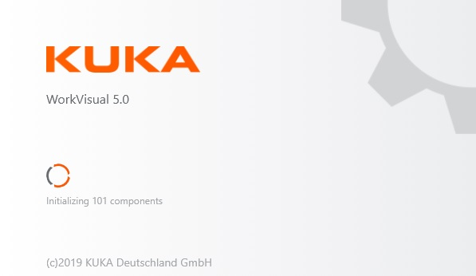
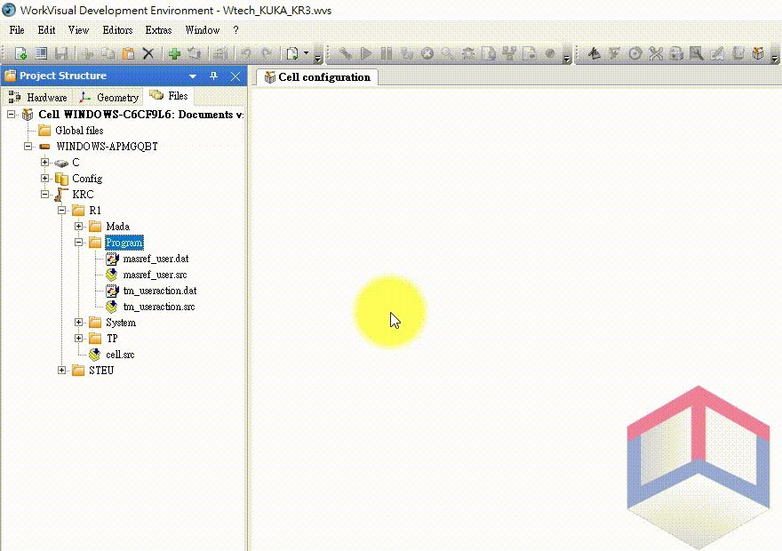
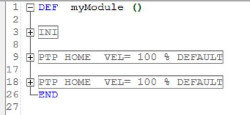

# KUKA Robot Language（KRL）

## WorkVisual

WorkVisual是KUKA機器人的程式端開發環境

- Workvisual 5.0啟動畫面



## KRL教學

KRL程式分為.src與.dat兩個檔案，.src描述了程式的動作，.dat存放著.src中所需要用到的程式變數。可在WorkVisual中的Project Structure欄位新增.src與.dat檔案到專案內，或是透過匯入的方式將已寫好的檔案加入WorkVisual專案中

- 新增.src與.dat檔案



- WorkVisaul中一段自動生成的程式碼



在KRL中，程式碼會由數個DEF-END或是DEFFCT-ENDFCT的區塊構成

## 命名變數

在KRL中的命名受到以下規範

- **最長**僅能24個字元
- **僅能使用**26個英文字母（A-Z）、10個數字（0-9）與2個特殊字元「_」、「$」
- 命名時第一個字元**不能**使用數字
- 命名時**不能**使用關鍵字

## 宣告變數

在KRL中的宣告受到以下規範

- 在.src檔中宣告變數時，需要宣告在DEF與INI之間的區域，並在INI之後賦予初始值
- 變數可以宣告為區域變數或是全域變數（GLOBAL）

語法
```
DECL Data_Type Variable_Name
```

範例：宣告變數

1.在.src檔中
```
DEF DefineValueExample
    DECL INT Counter
    INI
    Counter = 5
END
```

2.在.dat檔中
```
DEFDAT DefineValueExample
    DECL INT Counter = 5
ENDDAT
```

## 資料型態

### 整數（Integer）
- 關鍵字：INT
- 定　義：不包含小數點之正負數
- 範　圍：-2147483648 ~ 2147483647

### 浮點數（Floatingpoint number）
- 關鍵字：REAL
- 定　義：包含小數點之正負數
- 範　圍：±1.1E-38 ~ ±3.4E+38

### 布林（Boolean）
- 關鍵字：BOOL
- 定　義：邏輯狀態
- 範　圍：TRUE、FALSE

### 字元（Character）
- 關鍵字：CHAR
- 定　義：任一文字的字母
- 範　圍：ASCII編碼的字元編號

### 陣列（Array）

陣列是由多個相同型態的資料依序排列後所產生的資料型態

語法：宣告
```
DECL Data_Type Variable_Name[Number_of_Elements]
```

語法：給值
```
Variable_Name[Array_Index] = Value
```

範例

Measurement是一個有5個元素的浮點數陣列
第3個元素的值是7.23
```
DECL REAL Measurement[5]

Measurement[3] = 7.23
```

### 結構（Structures）

結構是由多個相同或不同的資料型態組合而成

語法
```
STRUC Structure name Data_Type1 A, B, Data_Type2 C, D
```

KUKA的點位資料即是一種結構的變數
```
STRUC E6POS REAL X, Y, Z, A, B, C, E1, E2, E3, E4, E5, E6, INT S, T
```

範例
```
DEF StrucExample
    DECL E6POS Position
    INI

    Position = {X 0,Y 0,Z 0,A 0,B 0,C 0}

    Position.X = 100
    Position.Y = 200
    Position.Z = 300
END
```

### 枚舉（Enumeration）

枚舉是一個物件的所有可能取值的集合

語法
```
ENUM Enumeration_Type_Name Constant_1, Constant_n
```

KUKA的操作模式正是一種枚舉的資料型態，僅會有T1、T2、AUT、EXT四種模式
```
ENUM MODE_OP T1, T2, AUT, EX, INVALID
```

範例
```
ENUM Week Sun,Mon,Tue,Wed,Thu,Fri,Sat

DECL Week Today

Today = #Thu
```

## 運算子

運算子是用來對值操作，根據不同的操作又分為不同類型的運算子

- 算數運算子
- 關係運算子
- 邏輯運算子
- 布林邏輯運算子
- 位元運算子
- 向量運算子

### 算數運算子

這類運算子用於值之間的計算

- 「+」：作為加法運算或表達正數的符號
- 「-」：作為減法運算或表達負數的符號
- 「*」：作為乘法運算的符號
- 「/」：作為除法運算的符號

### 關係運算子

這類運算子用於比較兩個（或以上）的值之間的關係

- 「==」：比較符號兩側的值是否相等
- 「<>」：比較符號兩側的值是否不相等
- 「>」：比較符號左側的值是否大於符號右側的值
- 「<」：比較符號左側的值是否小於符號右側的值
- 「=>」：比較符號左側的值是否大於或等於符號右側的值
- 「<=」：比較符號左側的值是否小於或等於符號右側的值
