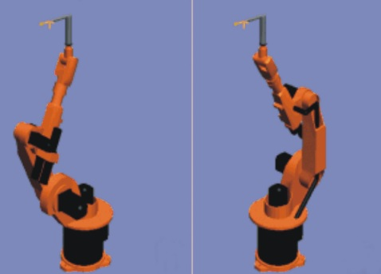
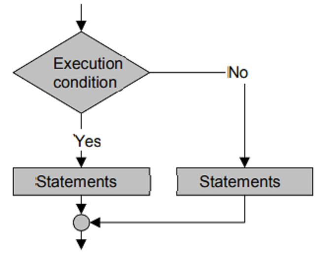
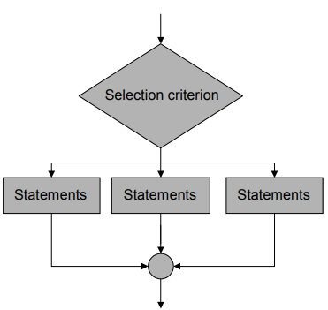

<style>
    .stress
    {
        color:#FF0000;
    }
    .keyWords
    {
        color:#00E3E3;
    }
</style>

# KUKA Robot Language（KRL）

## WorkVisual

WorkVisual是KUKA機器人的程式端開發環境

- Workvisual 5.0啟動畫面


## KRL教學

KRL程式分為.src與.dat兩個檔案，.src描述了程式的動作，.dat存放著.src中所需要用到的程式變數。可在WorkVisual中的Project Structure欄位新增.src與.dat檔案到專案內，或是透過匯入的方式將已寫好的檔案加入WorkVisual專案中

- 新增.src與.dat檔案


- WorkVisaul中一段自動生成的程式碼


在KRL中，程式碼會由數個DEF-END或是DEFFCT-ENDFCT的區塊構成

## 命名變數

在KRL中的命名受到以下規範

- **最長**僅能24個字元
- **僅能使用**26個英文字母（A-Z）、10個數字（0-9）與2個特殊字元「_」、「$」
- 命名時第一個字元**不能**使用數字
- 命名時**不能**使用關鍵字

## 宣告變數

在KRL中的宣告受到以下規範

- 在.src檔中宣告變數時，需要宣告在DEF與INI之間的區域，並在INI之後賦予初始值
- 在.dat檔中變數可以宣告為區域變數或是全域變數（GLOBAL），但須在DEFDAT檔名後方加上PUBLIC

語法

```
DECL Data_Type Variable_Name
```

範例：宣告變數

1.在.src檔中

```
DEF DefineValueExample
    DECL INT Counter
    INI
    Counter = 5
END
```

2.在.dat檔中宣告區域變數

```
DEFDAT DefineValueExample
    DECL INT Counter = 5
ENDDAT
```

3.在.dat檔中宣告全域變數

```
DEFDAT DefineValueExample PUBLIC
    DECL GLOBAL INT Counter = 5
ENDDAT
```

## 資料型態

### 整數（Integer）

- 關鍵字：INT
- 定　義：不包含小數點之正負數
- 範　圍：-2147483648 ~ 2147483647

### 浮點數（Floating point number）

- 關鍵字：REAL
- 定　義：包含小數點之正負數
- 範　圍：±1.1E-38 ~ ±3.4E+38

### 布林（Boolean）

- 關鍵字：BOOL
- 定　義：邏輯狀態
- 範　圍：TRUE、FALSE

### 字元（Character）

- 關鍵字：CHAR
- 定　義：任一文字的字母
- 範　圍：ASCII編碼的字元編號

### 陣列（Array）

陣列是由多個相同型態的資料依序排列後所產生的資料型態

語法：宣告

```
DECL Data_Type Variable_Name[Number_of_Elements]
```

語法：給值

```
Variable_Name[Array_Index] = Value
```

範例

Measurement是一個有5個元素的浮點數陣列
第3個元素的值是7.23

```
DECL REAL Measurement[5]

Measurement[3] = 7.23
```

### 結構（Structures）

結構是由多個相同或不同的資料型態組合而成

語法

```
STRUC Structure name Data_Type1 A, B, Data_Type2 C, D
```

KUKA的點位資料即是一種結構的變數

```
STRUC E6POS REAL X, Y, Z, A, B, C, E1, E2, E3, E4, E5, E6, INT S, T
```

範例

```
DEF StrucExample
    DECL E6POS Position
    INI

    Position = {X 0,Y 0,Z 0,A 0,B 0,C 0}

    Position.X = 100
    Position.Y = 200
    Position.Z = 300
END
```

### 枚舉（Enumeration）

枚舉是一個物件的所有可能取值的集合

語法

```
ENUM Enumeration_Type_Name Constant_1, Constant_n
```

KUKA的操作模式正是一種枚舉的資料型態，僅會有T1、T2、AUT、EXT四種模式

```
ENUM MODE_OP T1, T2, AUT, EX, INVALID
```

範例

```
ENUM Week Sun,Mon,Tue,Wed,Thu,Fri,Sat

DECL Week Today

Today = #Thu
```

## 運算子

運算子是用來對值操作，根據不同的操作又分為不同類型的運算子

- 算數運算子
- 關係運算子
- 布林邏輯運算子
- 位元運算子
- 向量運算子

### 算數運算子

這類運算子用於值之間的計算

- 「+」：作為加法運算或表達正數的符號
- 「-」：作為減法運算或表達負數的符號
- 「*」：作為乘法運算的符號
- 「/」：作為除法運算的符號

### 關係運算子

這類運算子用於比較兩個（或以上）的值之間的關係

- 「==」：比較符號兩側的值是否相等
- 「<>」：比較符號兩側的值是否不相等
- 「>」：比較符號左側的值是否大於符號右側的值
- 「<」：比較符號左側的值是否小於符號右側的值
- 「=>」：比較符號左側的值是否大於或等於符號右側的值
- 「<=」：比較符號左側的值是否小於或等於符號右側的值

### 布林邏輯運算子

- 「NOT」：將布林值結果反轉
- 「AND」：比較符號兩側的布林值。其中一方為FALSE，輸出結果即為FALSE
- 「OR」：比較符號兩側的布林值。其中一方為TRUE，輸出結果即為TRUE
- 「EXOR」：比較符號兩側的布林值是否一致，一致為FALSE，不一致為TRUE

### 位元運算子

- 「B_NOT」：用於對二進制數字的每個位元進行「NOT」運算
- 「B_AND」：用於對符號兩側的二進制數字的每個位元進行「AND」運算
- 「B_OR」：用於對符號兩側的二進制數字的每個位元進行「OR」運算
- 「B_EXOR」：用於對符號兩側的二進制數字的每個位元進行「EXOR」運算

### 向量運算子

以「:」表示，意為在左邊的位置／移動右邊的距離

隨著兩邊使用的型態不同，會影響到最終結果的型態

結果參考下列表格

| 左邊型態 | 右邊型態 | 結果 |
| ---- | ---- | ---- |
| POS | POS | POS |
| POS | FRAME | FRAME |
| FRAME | FRAME | FRAME |
| FRAME | POS | POS |

### 優先度

| 優先度 | 運算子 |
| ------ | ------ |
| 1(HIGH) | NOT、B_NOT |
| 2 | *、/ |
| 3 | +、- |
| 4 | AND、B_AND |
| 5 | EXOR、B_EXOR |
| 6 | OR、B_OR |
| 7(Low) | ==、<>、<、>、<=、>= |

## 動作程式

機器手臂動作時，基於4個座標系統

| 座標系統 | 系統變數 | 狀態 |
| --- | --- | --- |
| 世界座標 | $WORLD | 唯讀 |
| ROBOT座標 | $ROBROOT | 唯讀(可透過$MACHINE.dat內修改) |
| TOOL座標 | $TOOL | 可修改 |
| BASE座標 | $BASE | 可修改 |

出廠預設$BASE與$WORLD一致，在程式碼中透過可透過$TOOL、$BASE、$LOAD切換不同工具資料

```
$TOOL = TOOL_DATA[1]
$BASE = BASE_DATA[1]
$LOAD = LOAD_DATA[1]
```


※原廠手冊中有註明，切換$TOOL時應一併切換$LOAD的資料，否則若因此造成撞機，將無保固

### PTP

Point-to-Point，此動作為手臂直接將各軸馬達角度轉動到點位上的角度

為三種動作中速度最快者，但此動作不保證TCP水平移動，若是手臂工具上是夾取液態的容器，容器內的液體可能會有灑出的狀況

S與T

座標位置(X,Y,Z)不足以明確表達機器手臂的角度或姿態，S(Status)與T(Turn)便是為了更明確指出手臂的角度及姿態而誕生

S、T的數值紀錄在POS/E6POS兩種型態中，並且只有PTP的動作類型有效

- S與T介紹：相同的點位，卻無法得知各軸角度



語法

```
PTP 點位名字
PTP {點位資料}
PTP_REL {軸 角度}  ;以當前位置做相對位置移動
```

範例

```
E6POS MY_POSITION
MY_POSITION = {X 250,Y 0,Z 200,A 0,B 0,C 0}
PTP MY_POSITION

PTP {A1 0,A2 -90,A3 90,A4 0,A5 0,A6 0}

PTP_REL {A1 90}
```

### LIN

LINE此動作機器手臂會保持TCP維持一樣的傾角(?)走到目標點位

語法

```
LIN 點位名字    ;只能POS/E6POS的資料型態
LIN {點位資料}  ;只能POS/E6POS的資料型態
LIN_REL {方向 數值}  ;以當前位置做相對位置移動
```

範例

```
E6POS MY_POSITION
MY_POSITION = {X 250,Y 0,Z 200,A 0,B 0,C 0}
LIN MY_POSITION

LIN {X 250,Y 0,Z 200,A 0,B 0,C 0}

LIN_REL {X 90}
```

### CIRC(不常用，經驗較少)

CIRCLE此動作需要一個參考點，機器手臂會經過參考點，走弧線到目標點位

語法

```
CIRC 參考點名字,目標點名字    ;只能POS/E6POS的資料型態
CIRC {參考點},{目標點}       ;只能POS/E6POS的資料型態
```

### CP動作

在LIN或CIRC動作指令中的點為後面，可以增加關鍵字，讓手臂不用真的到達該點位。通常用在閃躲現場機構等，不需要精確到位的點位，以節省手臂動作的時間

| 關鍵字 | 說明 | 單位 | 系統變數 |
| ---- | ---- | ---- | ---- |
| C_DIS | 與點位距離 | mm | $APO.CDIS |
| C_ORI | 等待補充 | ° | $APO.CORI |
| C_VEL | 等待補充 | % | $APO.CVEL |

語法
```
LIN 點位名字 C_DIS

LIN 點位資料 C_DIS
```

## 條件運算式

用來比較條件的結果，決定程式接下來應採取的行動

### IF-ELSE

二選一的判斷。IF可單獨使用，不一定要有ELSE的區塊

條件為TRUE時執行，條件為FALSE則執行ELSE的區塊

- IF-ELSE流程圖




語法

```
BOOL IS_SUNNY
IS_SUNNY = TRUE
IF (IS_SUNNY) THEN
    MsgNotify(Today is sunny day")  ;IS_SUNNY是TRUE會執行這邊
ELSE
    MsgNotify(Today is not sunny day")
ENDIF
```

### SWITCH-CASE

多選一的判斷。根據條件的數值，執行對應的結果

- SWITCH-CASE流程圖



語法

```
ENUM WEATHER_TYPE SUNNY,RAINY,CLOUDY
DECL WEATHER_TYPE TODAY_WEATHER
TODAY_WEATHER = #SUNNY

SWITCH TODAY_WEATHER
    CASE #SUNNY
        MsgNotify(Today is sunny day")  ;TODAY_WEATHER是#SUNNY，所以會執行這裡
    CASE #RAINY
        MsgNotify(Today is rainy day")
    CASE #CLOUDY
        MsgNotify(Today is cloudy day")
    DEFAULT
ENDSWITCH
```

## 迴圈

一樣的事情重複做

### FOR

使用FOR迴圈需要宣告一個迴圈計數器

當迴圈計數器達到條件後，迴圈便會結束

語法

```
INT _I,_COUNTER ;迴圈計數器
_COUNTER = 0

;從1開始，每次執行後+1(STEP的數值)，當_i達到100後離開迴圈
FOR _I = 1 TO 100 STEP 1
    _COUNTER = _COUNTER + _I
ENDFOR
```

### WHILE

使用WHILE迴圈時需要設定一個條件

先判斷條件，且結果是TRUE時才會執行迴圈內的動作

語法

```
INT _I,_COUNT

_I = 1
_COUNT = 1

WHILE _I <= 10
    _COUNT = _COUNT * _I
    _I = _I + 1
ENDWHILE
```

### REPEAT

使用REPEAT迴圈時需要設定一個條件

先執行迴圈內的動作，再判斷條件，結果是TRUE時，不會再重複執行迴圈內的動作

※REPEAT與WHILE的差別，在於REPEAT至少會執行一次迴圈內的動作

語法

```
INT _I,_COUNT

_I = 1
_COUNT = 1

REPEAT
    _COUNT = _COUNT * _I
    _I = _I + 1
UNTIL _I > 10
```

### LOOP

LOOP會一直執行回圈內的動作，不會主動停止

需要使用<span class="keyWords">EXIT</span>關鍵字離開LOOP迴圈

語法

```
INT _I,_COUNT

_I = 1
_COUNT = 1

LOOP
    _COUNT = _COUNT * _I
    _I = _I + 1

    IF _I > 10 THEN
        EXIT
    ENDIF
ENDLOOP
```

## 流程控制

### WAIT

### HALT

### GOTO
