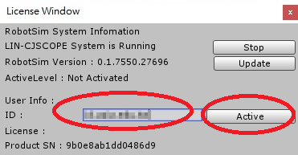

# 探索新世界－RobotSim

## 在RobtSim中能做什麼

- 加入夾爪，讓機器手臂取放物件
- 把機器手臂放在滑軌上，讓運作空間更大
- 規劃一條生產線
- 設計一套自動化流程，產生各種機器手臂的程式
- 你還想做什麼？ [加入RobotSim討論區一起討論吧](http://forum.wtech.com.tw/viewforum.php?f=17&sid=4a42cdd8643e5518dd23f732ca23f0c4)

 

# RobotSim 模擬軟體

## 線上模擬環境

我們已經把模擬環境放在網站上了

連結在[這裡](http://www.wtech.com.tw/robotsim/demo)

在模擬環境中可以學到

    一.座標系
        1.WORLD
        2.BASE
        3.TOOL
    二.操作方式
        1.XYZ、ABC
        2.Axis
    三.運動指令
        1.PTP
        2.LIN
        3.CIRC

## RobotSim 下載、安裝、試用
- RobotSim 執行環境 Unity [下載](https://store.unity.com/#plans-individual)
- RobotSim 軟體 [下載](http://www.wtech.com.tw/robotsim/download)
- 開啟Unity選單列的RobotSim/License視窗
- 輸入試用帳號（ID）
- 啟動授權（Active）

    

- 參考影片
<iframe width="480" height="270" src="https://www.youtube.com/embed/xv4v_fOwAC0?controls=0" frameborder="0" allow="accelerometer; autoplay; clipboard-write; encrypted-media; gyroscope; picture-in-picture" allowfullscreen></iframe>

### 其他資源
- [討論區](http://forum.wtech.com.tw/viewforum.php?f=17&sid=4a42cdd8643e5518dd23f732ca23f0c4)

- 機器手臂模型們 [SimModel](http://www.wtech.com.tw/robotsim/simmodel)

## RobotSim環境與基本操作

## RobotSim程式設計

-
-
-
-
-
-
