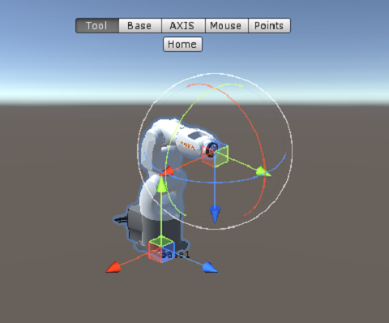

# 探索新世界－RobotSim

## 在RobtSim中能做什麼

- 加入夾爪，讓機器手臂取放物件
- 把機器手臂放在滑軌上，讓運作空間更大
- 規劃一條生產線
- 設計一套自動化流程，產生各種機器手臂的程式
- 你還想做什麼？ [加入討論區一起討論吧](http://forum.wtech.com.tw)

 

# RobotSim 模擬軟體

RobotSim可以視為unity的套件，並透過unitypackage安裝到unity環境中

## RobotSim 下載、安裝、試用

### 要準備的東西

- RobotSim 執行環境 Unity [到這裡下載](https://store.unity.com/#plans-individual)
- RobotSim 軟體 [參考網頁](http://www.wtech.com.tw/robotsim/download)

※ RobotSim目前已不支援試用版，若有相關需求請來信至 [***卓智機器人***](http://www.wtech.com.tw)

### 安裝RobotSim

    一.啟動unity
    二.建立新專案
        1.輸入專案名稱
        2.選擇存檔路徑
    三.匯入RobotSim安裝包
        1.在Project欄位的Assets區塊點擊右鍵
        2.選擇Import Package/Custom package...
        3.選擇RobotSim的unitypackage檔案

- 建立unity專案

- 匯入RobotSim

### 註冊

    一.開啟Unity選單列的RobotSim/License視窗
    二.輸入試用帳號（ID）
    三.啟動授權（Active）

- 參考影片
<iframe width="450" height="253" src="https://www.youtube.com/embed/xv4v_fOwAC0?controls=0" frameborder="0" allow="accelerometer; autoplay; clipboard-write; encrypted-media; gyroscope; picture-in-picture" allowfullscreen></iframe>

### 建立場景

    一.匯入機器手臂模型包
        1.在Project欄位的Assets區塊點擊右鍵
        2.選擇Import Package/Custom package...
        3.選擇機器手臂的unitypackage檔案
    二.建立RobotSim場景
        1.點選Unity選單列的RobotSim
        2.選擇Create/Empty RobotSim Scene
    三.加入機器手臂
        1.開啟Unity選單列的RobotSim/Window/SimModel Window
        2.點選要加入場景的機器手臂

- 匯入手臂、建立場景

### 其他資源

- [RobotSim討論區](http://forum.wtech.com.tw/viewforum.php?f=17&sid=4a42cdd8643e5518dd23f732ca23f0c4)

- 機器手臂模型們 [SimModel](http://www.wtech.com.tw/robotsim/simmodel)

 

## 線上模擬環境

我們已經把模擬環境放在網站上了

連結在[這裡](http://www.wtech.com.tw/robotsim/demo)

在模擬環境中可以學到

    一.座標系
        1.WORLD
        2.BASE
        3.TOOL
    二.操作方式
        1.XYZ、ABC
        2.Axis
    三.運動指令
        1.PTP
        2.LIN
        3.CIRC

 

## RobotSim環境與操作

在RobotSim中，共有5大功能分別設置在不同的視窗中，這些視窗可由Unity的選單列中的RobotSim/Window開啟

分別是：

- Robot Windows：可以查看、調整機器手臂的參數或狀態

- Program Window：可以在RobotSim環境中插入KRL語法讓控制器執行（？

- Controller Window：主要設置哪部機器手臂執行哪支程式，或是查看程式執行狀態

- Export Window：可以調整程式輸出的相館設定

- SimModel Window：可以在此視窗中挑選不同型號的機器手臂加入場景中

### 機器手臂的TOOL

關於TOOL的介紹，在隔壁頁有詳細說明 [傳送門](./02_Basis.html)

RobotSim2的本質用於機器手臂的動作模擬，因此夾爪也是機器手臂的一環

### 移動機器手臂

從"Hierarchy"清單或是"Scene"視窗中點選要移動的機器手臂，
在"Scene"視窗上方便會顯示「Tool」、「Base」、「AXIS」、「Mouse」、「Points」與「Home」的按鈕，做為移動機器手臂的參考

- Tool

- Base

- AXIS

- Mouse

- Points：

- Home：讓機器手臂立即回到Home點

### 教點

## RobotSim程式設計

### 變數

### 迴圈

### 判斷

### 機器手臂的動作

#### PTP

#### LIN

#### CIRC

### 自訂的RobotSim程式

## RobotSim範例－夾娃娃機

-
-
-
-
-
-
