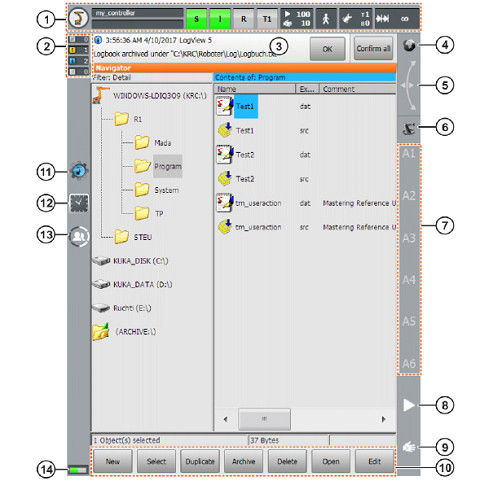

# 安全檢查

機器手臂雖為工具，但仍具備危險性，因此必須遵從標準作業流程進行操作

機器手臂於工作站內進行作業時，不允許任何人員進入。只要有人員闖入，機器手臂必須透過機械互鎖（Interlock）的方式，不經過CPU，而是直接由安全系統ESC（Electronic Safety Circuit）緊急停止。

詳細安全規範請參考 [安全檢查表](./Safety.html)

# 機器手臂基本介紹

## 六軸機器手臂

- 機器手臂本體、教導器與控制器

## SCARA機器手臂

## 機器手臂教導器 SmartPAD

- SmartPAD 正面

    

①USB：可將程式透過隨身碟上傳到控制器

②斷線按鈕：拔除教導器的按鈕

③模式旋鈕：切換模式（T1、T2、AUT、EXT）

④緊急停止按鈕

⑤6D滑鼠

⑥軸∕座標吋動按鈕：控制單軸移動

⑦手帶

⑧程式速度控制按鈕：手動程式∕自動模式的運轉速度+∕-

⑨手動速度控制按鈕：吋動模式的運轉速度+∕-

⑩連接線：連接至KR C4的訊號線

⑪自訂按鈕：供擴充套件使用

⑫開始鍵：開始執行程式

⑬倒退鍵：T1模式中移動回上一個位置

⑭暫停鍵：暫停執行中的程式

⑮鍵盤鍵：開啟∕關閉虛擬鍵盤

⑯主選單鍵：開啟∕關閉主選單

- SmartPAD 背面

    

①背帶固定扣（選配）

②支撐帶

③左側拱頂（右手握）

④啟用開關（Engage）：在T1∕T2模式下必須輕壓才能吋動手臂或執行程式，若是未壓下或是重壓則機器手臂會停止動作

⑤開始鍵：開始執行程式

⑥啟用開關

⑦手帶

⑧連接線蓋板

⑨啟用開關

⑩右側拱頂（左手握）

- SmartPAD 主畫面

    

## 軸向

- A1~A6軸

    

## 座標

### 世界座標
    以機器手臂底座中心為原點，X軸為前後、Y軸為左右、Z軸為上下

### BASE座標
    可由使用者自訂X、Y軸方向與角度，以克服機器手臂在非水平的工作平面下作業的需求

### TOOL座標
    ......

