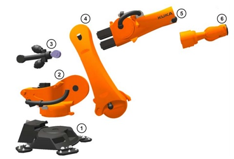
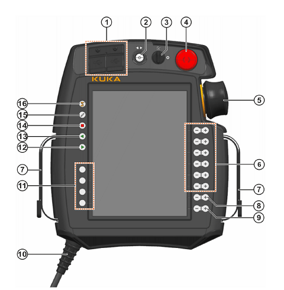
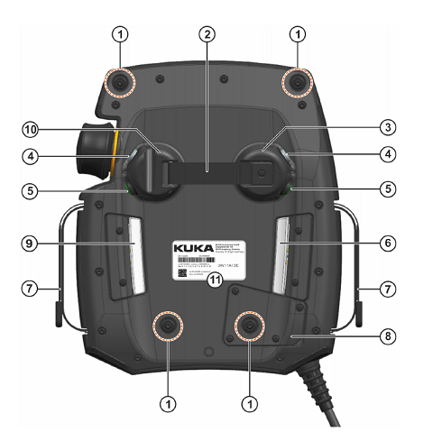
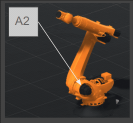
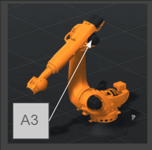
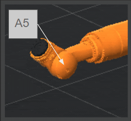
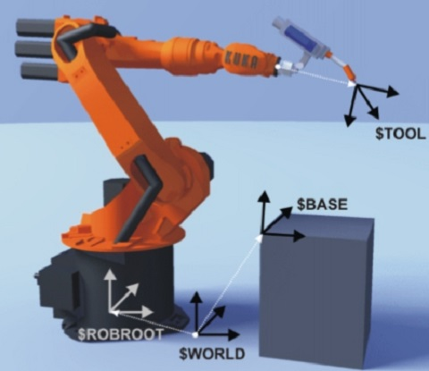
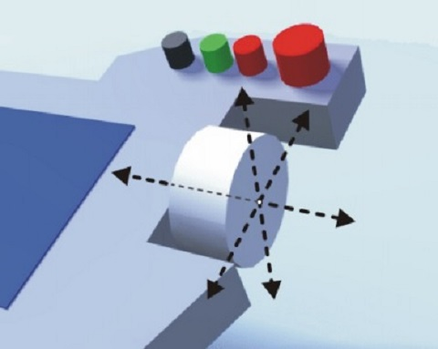
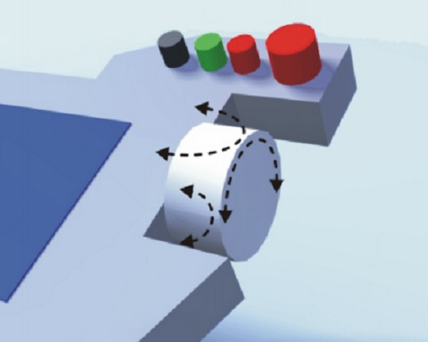

# 卓智機器人KUKA教育訓練文件

卓智機器人於2014.05.02創立於DAKUO（高雄市數位內容創意中心），公司以機器手臂自動化系統整合工程為主業

卓智所服務的領域涵蓋各種產業，包含成功商轉的機器手臂手沖咖啡，電子廠晶圓檢測、搬運、PCB上下料，工業電腦主機板檢測，傳統產業的沖壓機及導角機上下料，CNC自動上下料，微電子開關自動化檢等。所執行之各項工程均能達成穩定、快速投產的目標，大幅提高產能，為客戶創造更高的營收與價值

除持續為替客戶開發設計最佳自動化方案外，也陸續投入系統整合所需各項專業先導型研究，以創新技術能量、厚植實力，為台灣產業升級奉獻我們綿薄的力量

 [官方網站](http://www.wtech.com.tw)

 

## 安全檢查

機器手臂雖為工具，但仍具備危險性，因此必須遵從標準作業流程進行操作

機器手臂於工作站內進行作業時，不允許任何人員進入。只要有人員闖入，機器手臂必須透過機械互鎖（Interlock）的方式，不經過CPU，而是直接由安全系統ESC（Electronic Safety Circuit）緊急停止。

詳細安全規範請參考 [安全檢查表](./Safety.html)

 

## 機器手臂基本介紹

### 六軸機器手臂

機器手臂是能模仿人類手臂功能並可完成各種作業的自動控制設備，構造上由機械主體、控制器、伺服機構與感測器組成，有多個關節連結並允許在平面或三度空間進行線性移動

自從機器手臂技術開始發展後，已成功應用於許多工業危險之組裝、噴漆、焊接、高溫鑄緞等繁重工作，也能發現在商業、農業、醫療、娛樂都有機器手臂的應用

[維基百科](https://reurl.cc/7yDp25)

- 機器手臂系統

①機器人本體

②控制器

③教導器（SmartPAD）

④連接線（動力線、訊號線等）

- 機器手臂結構

①底座

②轉盤

③平衡系統

④連結臂

④手臂

⑤腕關節

- 機器手臂骨架

①機器人實體

②運動鏈起點（ROBROOT）

③運動鏈自由端（法蘭）

 

### SCARA機器手臂

SCARA是**選擇順應性裝配機器手臂**（Selective Compliance Assembly Robot Arm）或**選擇順應性關節機器手臂**（Selective Compliance Articulated Robot Arm）的簡稱，也會翻譯為**水平多軸機器手臂**

相較於直角坐標系的機器手臂，SCARA的反應會比較快、設備也會比較乾淨。也因為需要的佔地面積比較小，所以能更靈活的安裝

[維基百科](https://reurl.cc/Gdxx1v)

[KUKA SCARA](https://reurl.cc/E2rrAg)

 

### DELTA機器手臂

Delta機器人又稱三角式機器人，由三個機械臂連接機器人上的萬向接頭以及末端效應器（End Effector），主要設計特點是在機械臂上使用平行四邊形結構

Delta機器人速度非常快，常用在工業的檢拾及包裝作業

[維基百科](https://reurl.cc/e933Rb)

 

### 機器手臂教導器（SmartPAD）

- SmartPAD-2 正面

①USB：可將程式透過隨身碟上傳到控制器

②斷線按鈕：拔除教導器的按鈕

③模式旋鈕：切換模式（T1、T2、AUT、EXT）

④緊急停止按鈕

⑤6D滑鼠

⑥軸∕座標吋動按鈕：控制單軸移動

⑦手帶

⑧程式速度控制按鈕：手動程式∕自動模式的運轉速度+∕-

⑨手動速度控制按鈕：吋動模式的運轉速度+∕-

⑩連接線：連接至KR C4的訊號線

⑪自訂按鈕：供擴充套件使用

⑫開始鍵：開始執行程式

⑬倒退鍵：T1模式中移動回上一個位置

⑭暫停鍵：暫停執行中的程式

⑮鍵盤鍵：開啟∕關閉虛擬鍵盤

⑯主選單鍵：開啟∕關閉主選單

- SmartPAD-2 背面

①背帶固定扣（選配）

②支撐帶

③左側拱頂（右手握）

④啟用開關（Engage）：在T1∕T2模式下必須輕壓才能吋動手臂或執行程式，若是未壓下或是重壓則機器手臂會停止動作

⑤開始鍵：開始執行程式

⑥啟用開關

⑦手帶

⑧連接線蓋板

⑨啟用開關

⑩右側拱頂（左手握）

- 主畫面

①狀態列

②訊息圖示

③訊息欄

④6D滑鼠座標空間參考

⑤6D滑鼠相對位置切換

⑥吋動座標空間參考

⑦吋動方向參考

⑧速度調整參考圖示（程式用）

⑨速度調整參考圖示（吋動用）

⑩功能按鈕區

⑪專案資訊按鈕

⑫時間資訊按鈕

⑬權限切換按鈕

⑭SmartHMI狀態

-- 狀態列

①主選單按鈕：開啟∕關閉主選單

②控制器名稱：顯示幕前控制器的名稱

③程式名稱：顯示目前選擇∕執行的程式名稱

④Submit interpreter（暫時還想不到怎麼翻譯）

⑤Driver狀態：

⑥Robot interpreter

⑦操作模式狀態：顯示目前操作的模式（T1、T2、Aut、Ext）

⑧速度狀態圖示：顯示程式∕吋動速度

⑨Program run mode

⑩Tool∕Base狀態：顯示目前使用的Tool與Base

⑪Incremental jogging

 

### 軸向

- A1~A6軸

- A1旋轉軸位置

- A2旋轉軸位置

- A3旋轉軸位置

- A4旋轉軸位置

- A5旋轉軸位置

- A6旋轉軸位置

 

### 座標系

#### 世界座標
    以機器手臂底座中心為原點，X軸為前後、Y軸為左右、Z軸為上下

#### BASE座標
    可由使用者自訂X、Y軸方向與角度，以克服機器手臂在非水平的工作平面下作業的需求

#### TOOL座標
    ......

### 吋動方式

### 6D滑鼠使用方式

- 6D滑鼠方向

- 6D滑鼠旋轉

- 6D滑鼠與Tool的關係

 

# KUKA程式語言

## KRL

## WorkVisual

教學頁面 [在這裡](./Syntax.html)

 

# RobotSim模擬軟體

介紹頁面 [在這裡](./Sim.html)